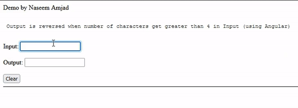

# Angular-Tip: (Binding TextBoxes in Angular)
Demonstration of binding 2 textboxes (inputs) , reversing a string.

## Problem Statement:
Two fields on a screen, INPUT and OUTPUT fields. As soon user reach typing 4 letters in input field it should show the input field's letters in reverse order in OUTPUT field. It should keep updating the OUTPUT field after every letter is typed in INPUT field. Use ANGULAR 10 or above.

## Solution
